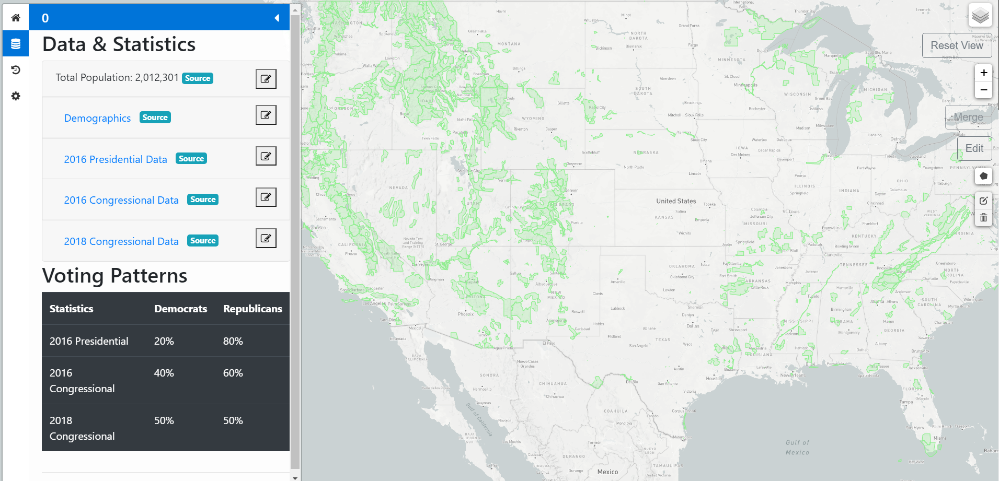
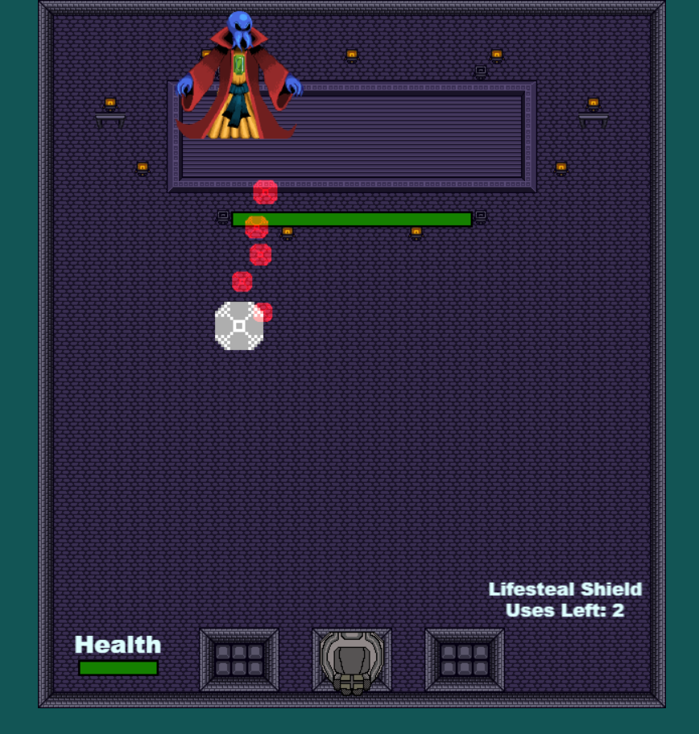
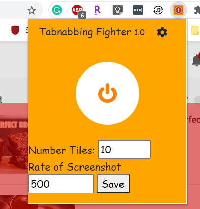

# Eric Mun

### Biography
Eric Mun currently works at Rightpoint as an e-commerce web developer. He studied computer science and digital art at Stony Brook University. Eric enjoys playing tabletop games with friends, acting as a community moderator and game designer for a tabletop community on Discord with 1000+ members.

### Contact
ericmun17@gmail.com

[LinkedIn](https://www.linkedin.com/in/eric-mun-313319167/)

[GitHub](https://github.com/DiZeroX)

### Projects

- Voting Data Editor
  - Web app that visualizes voting data on a geographic map and flags possible errors
  - Users can fix errors and flag new errors on a precinct-level
  - Preprocessed state election voting data by standardizing data formats, flags possible errors, clean geographic data
  - Implemented using Python scripts, React-Redux, SQL
  

- The Shield Hero Game 
  - Web app game based on blocking projectiles with the correct colored shield in an action-based memorization game
  - Implemented with JavaScript and the Phaser 3 game engine
  - [Play the game here!](https://the-shield-hero.firebaseapp.com/)
  
 

- Anti-Tabnabbing Browser Extension
  - Chrome extension that notifies user if a tab has changed contents while minimized (type of cyber attack)
  - Changed contents are highlighted red
  - Has whitelist/blacklist for websites
  

